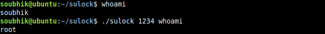

# sulock
sudo like command using setuid with or without password

this is a small example of the [setuid](https://en.wikipedia.org/wiki/Setuid) root in linux.



### Installisation

```
git clone https://github.com/s0ubhik/sul
cd sul
```
#### With password
```
make install
```

#### Without password
```
make install NOPASS=1
```
